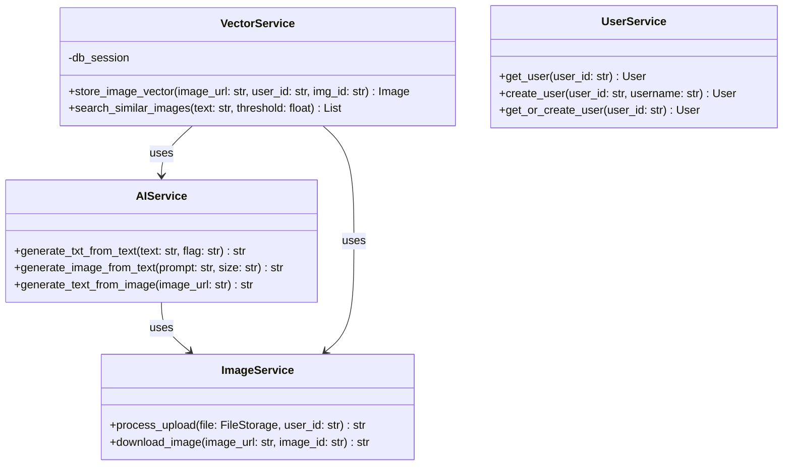

# 项目分工与设计文档

## 一、项目分工概述

作为两人开发小组的一员，我主要负责后端核心服务层的开发，包括 AI 服务、图片处理服务和向量服务。我的搭档负责 API 接口层的开发，包括路由处理和请求响应。

### 我负责的模块（后端核心服务）：
1. AIService：AI模型调用服务
2. ImageService：图片处理服务
3. VectorService：向量计算服务
4. UserService：用户管理服务

### 搭档负责的模块（API接口层）：
1. 认证相关接口（auth_bp）
2. 图片处理相关接口（init_bp, search_bp）
3. AI生成相关接口（text_to_image_bp, image_to_text_bp）
4. 用户图片管理接口（user_images_bp）

## 二、类的设计

### 1. AIService 类设计
```python
class AIService:
    """AI服务类，处理所有与AI模型相关的操作"""
    
    @staticmethod
    def generate_txt_from_text(text: str, flag: str) -> str:
        """文本优化/翻译"""
        pass
        
    @staticmethod
    def generate_image_from_text(prompt: str, size: str) -> str:
        """文生图"""
        pass
        
    @staticmethod
    def generate_text_from_image(image_url: str) -> str:
        """图生文"""
        pass
```

### 2. ImageService 类设计
```python
class ImageService:
    """图片处理服务类"""
    
    @staticmethod
    def process_upload(file: FileStorage, user_id: str) -> str:
        """处理上传图片"""
        pass
        
    @staticmethod
    def download_image(image_url: str, image_id: str) -> str:
        """下载图片"""
        pass
```

### 3. VectorService 类设计
```python
class VectorService:
    """向量服务类"""
    
    def __init__(self, db_session):
        self.db_session = db_session
        
    def store_image_vector(self, image_url: str, user_id: str, img_id: str) -> Image:
        """存储图片向量"""
        pass
        
    def search_similar_images(self, text: str, threshold: float = 0.5) -> List[Dict]:
        """搜索相似图片"""
        pass
```

## 三、模块间接口定义

### 1. AIService 与 API 层接口
```python
# 文生图接口
@text_to_image_bp.route('/api/generate/image', methods=['POST'])
def generate_image():
    text = request.json.get('text')
    size = request.json.get('size', 'medium')
    # 调用 AIService
    image_url = AIService.generate_image_from_text(text, size)
    return jsonify({'image_url': image_url})

# 图生文接口
@image_to_text_bp.route('/api/generate/text', methods=['POST'])
def generate_text():
    image_url = request.form.get('image_path')
    # 调用 AIService
    text = AIService.generate_text_from_image(image_url)
    return jsonify({'text': text})
```

### 2. VectorService 与 API 层接口
```python
# 图片搜索接口
@search_bp.route('/api/search', methods=['POST'])
def search_images():
    text = request.json.get('text')
    threshold = request.json.get('threshold', 0.5)
    # 调用 VectorService
    vector_service = VectorService(db.session)
    results = vector_service.search_similar_images(text, threshold)
    return jsonify({'results': results})
```

## 四、开发思考与联调经验

### 1. 架构设计思考
在设计后端架构时，我采用了分层设计模式：
- 将 AI 相关功能封装在 AIService 中，便于统一管理模型调用
- 使用 VectorService 处理向量计算，支持后续扩展不同的向量检索方案
- ImageService 负责图片处理，确保图片的压缩和存储标准统一

### 2. 与搭档的协作经验
1. 接口定义阶段：
   - 我们先确定了 API 的基本格式和参数
   - 约定了错误处理的标准方式
   - 定义了统一的返回值格式

2. 开发过程中：
   - 使用 Git 进行版本控制，约定了分支管理策略
   - 保持频繁沟通，及时同步开发进度
   - 建立了完整的测试用例，确保接口的正确性

3. 联调过程：
   - 先完成单元测试，确保各自模块的正确性
   - 进行集成测试，验证模块间的交互
   - 使用 Postman 进行接口测试
   - 记录并跟踪发现的问题

### 3. 遇到的挑战与解决方案
1. AI 模型加载问题：
   - 问题：模型加载耗时，影响响应速度
   - 解决：实现模型预加载和缓存机制

2. 图片处理性能：
   - 问题：大量图片并发处理时性能下降
   - 解决：实现异步处理队列，分批处理图片

3. 数据一致性：
   - 问题：并发操作时的数据同步
   - 解决：使用数据库事务和锁机制

### 4. 改进建议
1. 可以考虑添加缓存层，提高常用数据的访问速度
2. 实现更完善的错误处理机制
3. 添加性能监控和日志系统
4. 考虑横向扩展的可能性

## 五、类图


通过这次项目，我深刻体会到了良好的代码组织和团队协作的重要性。清晰的接口定义和模块划分不仅提高了开发效率，也让后期的维护变得更加容易。 

## 六、前后端联调过程

### 我负责的联调部分（核心服务层）

#### 1. AI服务联调
1. 文本优化功能联调：
   - 问题：前端传入的中文文本在优化后丢失表情符号
   - 解决：修改 generate_txt_from_text 方法，保留特殊字符
   - 验证：与前端开发确认文本完整性

2. 文生图功能联调：
   - 问题：生成的图片URL在前端无法正确显示
   - 原因：OSS访问权限配置问题
   - 解决：
     ```python
     def generate_image_from_text(prompt: str, size: str) -> str:
         # 添加OSS URL签名
         image_url = generate_image(prompt, size)
         return sign_oss_url(image_url, expires=3600)
     ```

3. 图生文功能联调：
   - 问题：前端上传大图片时响应超时
   - 解决：添加图片预处理和压缩
   - 代码调整：
     ```python
     def generate_text_from_image(image_url: str) -> str:
         image = ImageService.download_and_compress(image_url)
         return generate_description(image)
     ```

#### 2. 向量服务联调
1. 图片搜索功能：
   - 问题：搜索结果分页与前端组件不兼容
   - 解决：统一分页格式
   ```python
   def format_search_results(results: List[Dict], page: int, size: int) -> Dict:
       return {
           'items': results[(page-1)*size:page*size],
           'total': len(results),
           'current_page': page,
           'page_size': size
       }
   ```

2. 向量存储优化：
   - 问题：批量上传时向量计算速度慢
   - 解决：实现批量处理和进度回调
   ```python
   def batch_process_vectors(images: List[str], callback) -> None:
       for i, image in enumerate(images):
           vector = compute_vector(image)
           store_vector(vector)
           callback(i / len(images) * 100)
   ```

### 搭档负责的联调部分（API接口层）

#### 1. 认证接口联调
1. 登录接口：
   - 问题：Token 格式与前端存储方式不匹配
   - 解决：统一 Token 返回格式
   ```python
   @auth_bp.route('/api/auth/login', methods=['POST'])
   def login():
       return {
           'token_type': 'Bearer',
           'access_token': token,
           'expires_in': 3600
       }
   ```

2. 注册接口：
   - 问题：前端表单验证与后端不一致
   - 解决：统一验证规则和错误提示

#### 2. 图片上传接口联调
1. 批量上传：
   - 问题：进度显示不准确
   - 解决：实现 WebSocket 实时进度推送
   ```python
   @init_bp.route('/api/init/upload', methods=['POST'])
   def upload_images():
       socketio.emit('upload_progress', {
           'current': processed,
           'total': total,
           'status': 'processing'
       })
   ```

### 联调总结与反思

#### 1. 成功经验
1. 建立了完整的接口文档：
   - 使用 Swagger 自动生成接口文档
   - 前后端共同维护接口变更记录

2. 采用渐进式联调策略：
   - 先完成基础功能联调
   - 再处理异常情况
   - 最后优化性能

3. 有效的沟通机制：
   - 每日晨会同步进度
   - 建立问题跟踪表
   - 使用 Postman 共享接口测试用例

#### 2. 遇到的问题
1. 数据格式不统一：
   - 日期时间格式不一致
   - 分页参数命名不同
   - 错误响应结构不统一

2. 性能问题：
   - 图片上传和处理耗时
   - AI模型响应延迟
   - 大量数据的分页查询慢

#### 3. 改进措施
1. 技术层面：
   - 实现请求参数自动转换
   - 添加响应数据序列化层
   - 使用缓存优化性能
   ```python
   class ResponseFormatter:
       @staticmethod
       def format_response(data: Any) -> Dict:
           return {
               'code': 200,
               'message': 'success',
               'data': serialize(data)
           }
   ```

2. 协作层面：
   - 制定详细的接口规范文档
   - 建立自动化测试流程
   - 规范Git提交信息格式

#### 4. 个人总结
通过这次前后端联调，我深刻理解到：
1. 接口设计要考虑前端使用场景
2. 性能优化要从整体架构考虑
3. 良好的团队沟通至关重要
4. 规范的文档和测试能大大提高效率

这次联调经验让我对全栈开发有了更深的认识，也学会了如何更好地与前端团队协作。 